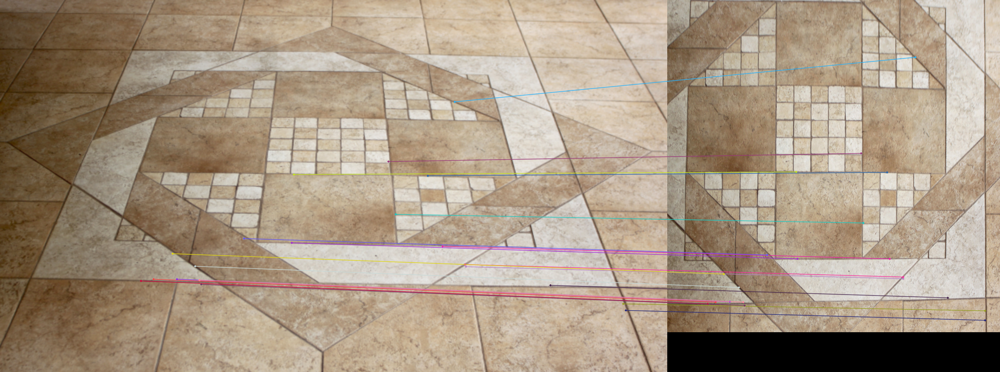
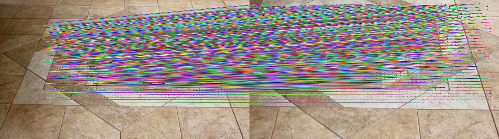
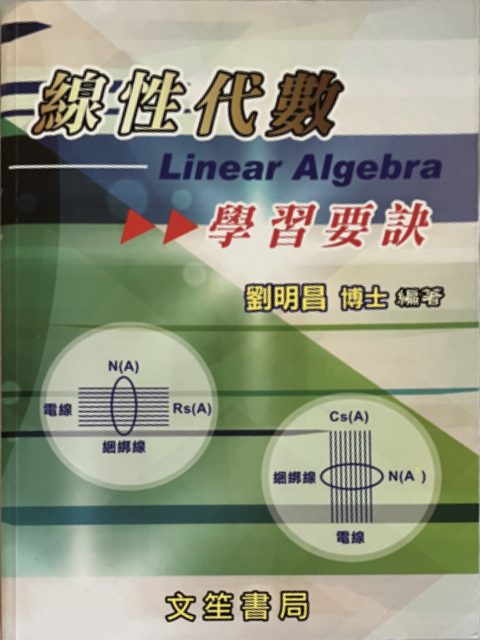

# **3DCV HW1**
Name: 吳泓毅  
Department: NTU CSIE  
Student ID: R11922029 

## **Problem 1: Homography estimation**

### **Screenshots**:

#### **Image pair (1-0.png, 1-1.png)**

sample 4 correspondeces

sample 8 correspondeces

sample 20 correspondeces

all correspondences


#### **Image pair (1-0.png, 1-2.png) removing outliers (matching 6 and 15) after ratio test**

sample 4 correspondeces

sample 8 correspondeces (outliers removed)

sample 20 correspondeces (outliers removed)

outliers before 20 correspondences (matching 6 and matching 15)

all correspondences


### **Compare the errors**

#### **Image pair (1-0.png, 1-1.png)**
|              |  k = 4 |k = 8 |k = 20|
|    :-----:   | :----: |:----:|:----:|
|DLT           | 138.817|1.502 |0.288 |
|Normalized DLT| 138.817|1.437 |0.280 |

#### **Image pair (1-0.png, 1-2.png) removing outliers (matching 6 and 15) after ratio test**
|              |  k = 4 |k = 8 |k = 20|
|    :-----:   | :----: |:----:|:----:|
|DLT           | 344.971|12.681 |5.713 |
|Normalized DLT| 344.971|29.617 |3.914 |

### **Other works to improve result(RANSAC)** 

 
RANSAC: an algorithm to fit model to inliers while ignoring outliers  

### **Screenshots (it may change for every execution)**:
#### **Image pair (1-0.png, 1-1.png)**
4 correspondeces 

  
#### **Image pair (1-0.png, 1-2.png)**
4 correspondeces


#### **Result of using RANSAC (running 10 times)**    
**d is the threshold used to identify a point that fit well**
#### **Image pair (1-0.png, 1-1.png) d = 2**
|   |1  |2  |3  |4  |5  |6  |7  |8  |9  |10 |average|
|:-:|:-:|:-:|:-:|:-:|:-:|:-:|:-:|:-:|:-:|:-:|:-:|
|error|0.522|0.543|0.623|0.447|0.627|0.520|0.668|0.416|0.784|0.541|0.569|

#### **Image pair (1-0.png, 1-1.png) d = 1**
|   |1  |2  |3  |4  |5  |6  |7  |8  |9  |10 |average|
|:-:|:-:|:-:|:-:|:-:|:-:|:-:|:-:|:-:|:-:|:-:|:-:|
|error|0.220|0.164|0.438|0.382|0.492|0.342|0.320|0.571|0.314|0.252|0.350|


#### **Image pair (1-0.png, 1-2.png) d = 2**
|   |1  |2  |3  |4  |5  |6  |7  |8  |9  |10 |average|
|:-:|:-:|:-:|:-:|:-:|:-:|:-:|:-:|:-:|:-:|:-:|:-:|
|error|0.939|1.148|2.247|0.930|2.023|1.566|1.494|0.688|2.263|1.948|1.525|

#### **Image pair (1-0.png, 1-2.png) d = 1**
|   |1  |2  |3  |4  |5  |6  |7  |8  |9  |10 |average|
|:-:|:-:|:-:|:-:|:-:|:-:|:-:|:-:|:-:|:-:|:-:|:-:|
|error|0.869|0.886|2.163|1.444|1.817|1.218|0.907|1.418|1.244|2.353|1.432|


### **Other works to improve result(Deep Learning)**   
LoFTR: Detector-Free Local Feature Matching with Transformers (CVPR 2021) 

##### **LoFTR architecture**


LoFTR is a detector-free model which removes the feature detector phase and directly produce dense descriptors or dense feature matches  

##### **Network flow**
1. Use CNN with FPN to extract multi-level features from both images to get **coarse-level features** and **fine-level features**.  

2. Coarse-level features are passed through LoFTR modules to extract position and context dependent local features. LoFTR modules contains several times of self-attention and cross-attention layer.  

3. After getting two transformed features from LoFTR module, do coarse matching to get matching between two transformed features.  

4. Pass **fine-level features** and matchings received by previous step through coarse-to-fine module to get more precise matching, this module also uses transformer.


#### **Screenshots**
#### **Image pair (1-0.png, 1-1.png)**

sample 4 correspondeces

sample 8 correspondeces

sample 20 correspondeces

all correspondences


#### **Image pair (1-0.png, 1-2.png)**

sample 4 correspondeces

sample 8 correspondeces

sample 20 correspondeces

all correspondences


##### **Resul of using Deep Learning**

##### **Image pair (1-0.png, 1-1.png)** 


|              |  k = 4 |k = 8 |k = 20|
|    :-----:   | :----: |:----:|:----:|
|DLT           | 8.252|0.915 |0.517 |
|Normalized DLT| 8.252|0.917 |0.520 |


##### **Image pair (1-0.png, 1-2.png)** 
|              |  k = 4 |k = 8 |k = 20|
|    :-----:   | :----: |:----:|:----:|
|DLT           | 32.104|35.475 |1.037  |
|Normalized DLT| 32.104|23.209 |0.437 |


##### **Result of using Deep Learning + RANSAC(running 10 times)**
##### **Image pair (1-0.png, 1-1.png) threshold d = 2**
|   |1  |2  |3  |4  |5  |6  |7  |8  |9  |10 |average|
|:-:|:-:|:-:|:-:|:-:|:-:|:-:|:-:|:-:|:-:|:-:|:-:|
|error|0.931|0.920|0.806|1.157|0.997|0.442|0.652|0.762|0.543|0.622|0.783|


##### **Image pair (1-0.png, 1-1.png) threshold d = 1**
|   |1  |2  |3  |4  |5  |6  |7  |8  |9  |10 |average|
|:-:|:-:|:-:|:-:|:-:|:-:|:-:|:-:|:-:|:-:|:-:|:-:|
|error|0.399|0.335|0.387|0.465|0.415|0.467|0.430|0.361|0.371|0.364|0.399|

##### **Image pair (1-0.png, 1-2.png) threshold d = 2**
|   |1  |2  |3  |4  |5  |6  |7  |8  |9  |10 |average|
|:-:|:-:|:-:|:-:|:-:|:-:|:-:|:-:|:-:|:-:|:-:|:-:|
|error|1.692|0.709|3.216|2.014|1.546|2.157|0.977|3.911|1.261|2.823|2.031|


##### **Image pair (1-0.png, 1-2.png) d = 1**
|   |1  |2  |3  |4  |5  |6  |7  |8  |9  |10 |average|
|:-:|:-:|:-:|:-:|:-:|:-:|:-:|:-:|:-:|:-:|:-:|:-:|
|error|1.173|1.303|0.727|1.467|1.132|0.980|1.191|0.751|1.190|0.624|1.05|


### **Discussion**

#### **DLT and normalized DLT**
The result of using normalized or not shows that with more pairs of matching, normalize operation can often get a lower reprojection error

#### **RANSAC**
The result shows that the 4 pairs of matching we get from RANSAC can have a great improvement(e.g., 344.971 to 1.525 in image pair 1-0.png 1-2.png with threshold d=1). So it shows that RANSAC can effectively remove outliers that may influence the result.

In Image pair 1-0.png 1-2.png, we need to see the connections and remove outlier manually without using RANSAC, but with RANSAC, we don't have to do this work anymore.

#### **Feature matching from Deep Learning**
The result shows that the 4 pairs of matching we get from Deep Learning model can have a great improvement(e.g., 344.971 to 32.104 in image pair 1-0.png 1-2.png). So it shows that LoFTR can work better than using ratio test after SIFT

#### **Deep Learning + RANSAC**
With setting threshold d=2, it shows that the result of using Deep learning + RANSAC is worse than using RANSAC. But when threshold d=1, Deep learning + RANSAC is nearly or better than using RANSAC. The reason I considered is that the matchings we get from Deep Learning is **so good** that we need a more strictly threshold to find **good** inliers in matchings.

### **Build environment**
Experiment Environment   
OS: Windows 10  
GPU: NVIDIA GeForce GTX 1050  


```shell
conda create --name 3dcvhw1 python=3.8 
conda activate 3dcvhw1
conda install pytorch torchvision torchaudio cudatoolkit=10.2 -c pytorch-lts 
pip install -r requirements.txt 
```


### **How to run code**
#### **output of program**
There will be three outputs, allpairs.png(in result folder), pairsforhomography.png(in result folder), and reprojection errors of DLT and normalized DLT. allpairs.png is the images that shows all correspondences. pairsforhomography.png is the images that shows correspondences for calculating homography. Reprojection errors is showed on terminal
#### **Basic** 
```shell
python 1.py --img1 [path to image1] --img2 [path to image2] --correspondence [path to correspondence file]
```  
##### **Example: Use 4 pairs of points**  
```shell
python 1.py --img1 ./images/1-0.png --img2 ./images/1-1.png  --correspondence ./groundtruth_correspondences/correspondence_01.npy
```
  
<br></br>

#### **Use more than 4 pairs**
```shell
python 1.py --img1 [path to image1] --img2 [path to image2] --correspondence [path to correspondence file] --pair [number of pairs] 
```
##### **Example: Use 8 pairs of points**  
```shell
python 1.py --img1 ./images/1-0.png --img2 ./images/1-1.png  --correspondence ./groundtruth_correspondences/correspondence_01.npy --pair 8
```
<br></br>

#### **Remove outlier manually（for image pair 1-0.png 1-2.png）**
```shell
python 1.py --img1 [path to image1] --img2 [path to image2] --correspondence [path to correspondence file] --pair [number of pairs] --outlier [point of outliers]
```
##### **Example: Use 20 pairs of points, the 6 and 15 matching in good_matches are removed**  
```shell
python 1.py --img1 ./images/1-0.png --img2 ./images/1-2.png  --correspondence ./groundtruth_correspondences/correspondence_02.npy --pair 20 --outlier 6 15
```
<br></br>

#### **Use RANSAC** 
```shell
python 1.py --img1 [path to image1] --img2 [path to image2] --correspondence [path to correspondence file] --ransac
```
##### **Example: Use 4 pairs of points selected by RANSAC after ratio test, the result may not be same from every execution**  
```shell
python 1.py --img1 ./images/1-0.png --img2 ./images/1-1.png  --correspondence ./groundtruth_correspondences/correspondence_01.npy --ransac
```

<br></br>

#### **Use deep learning**
```shell 
python 1.py --img1 [path to image1] --img2 [path to image2] --correspondence [path to correspondence file] --dl
```  
##### **Example: Use 4 pairs of points selected by deep learning**  
```shell
python 1.py --img1 ./images/1-0.png --img2 ./images/1-1.png  --correspondence ./groundtruth_correspondences/correspondence_01.npy --dl
``` 

<br></br>

#### **Use more than 4 pairs with deep learning**
```shell 
python 1.py --img1 [path to image1] --img2 [path to image2] --correspondence [path to correspondence file] --pair [number of pairs] --dl
```  
##### **Example: Use 8 pairs of points selected by deep learning**  
```shell
python 1.py --img1 ./images/1-0.png --img2 ./images/1-1.png  --correspondence ./groundtruth_correspondences/correspondence_01.npy --pair 8 --dl
``` 

<br></br>

#### **Use deep learning + RANSAC**
```shell
python 1.py --img1 [path to image1] --img2 [path to image2] --correspondence [path to correspondence file] --dl --ransac
```
##### **Example: Use 4 pairs of points selected by RANSAC after getting matching from deep learning, the result may not be same from every execution**  
```shell
python 1.py --img1 ./images/1-0.png --img2 ./images/1-1.png  --correspondence ./groundtruth_correspondences/correspondence_01.npy --dl --ransac
```


<br></br>

## **Problem 2: Document rectification**
### **Input document image**

### **Rectified result**


### **Method explanation**
#### **How to choose corners**
the order of choosing corners is left-up, left down, right down, right up 


#### **Step of Document Rectification**
1. Choose the corners by user
2. Calculate homography between corner points gotten by previos step and the corner of output image(640x480). 
3. Do backward warping, from every pixel of output image, use homography to find mapping point in input image. Then using bilinear interpolation to get the pixel value.
4. Store the image as book.png

#### **time complexity of bilinear interpolation**
Because we need to traverse all the pixels in output image, and the computation time of every pixel is same, so the time complexity is O(width_of_output*height_of_output)   

### **How to run code**
1. Running the code
```shell 
python 2.py --img ./images/book.png
```  
2. Choose corners(left-up -> left down -> right down -> right up) and then press esc
3. Result will be showed and store in result folder named book.png

## Reference
[LoFTR: Detector-Free Local Feature Matching with Transformers (CVPR 2021)](https://openaccess.thecvf.com/content/CVPR2021/papers/Sun_LoFTR_Detector-Free_Local_Feature_Matching_With_Transformers_CVPR_2021_paper.pdf) 

[LoFTR's github](https://github.com/zju3dv/LoFTR)
